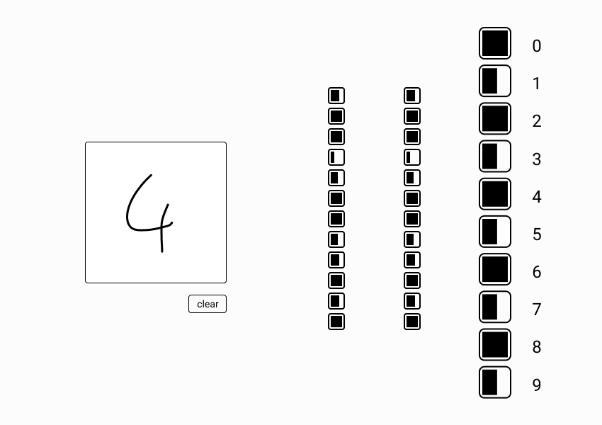

# Number Recognition

The data used for training the neural network is the [MNIST in csv](https://pjreddie.com/projects/mnist-in-csv/) dataset, which is based on the [MNIST database of handwritten digits](http://yann.lecun.com/exdb/mnist/)

**Made using:**

- Python 3.8.5
- Numpy 1.19.3
- tkinter 8.6
- Pillow 8.2.0
- Pandas 1.3.1

## Sources

<!-- py -m pip -->

- 3Blue1Brown. (2017). Neural networks. https://www.3blue1brown.com/neural-networks
- Lague, S. (2018). Neural Networks. YouTube. https://www.youtube.com/playlist?list=PLFt_AvWsXl0frsCrmv4fKfZ2OQIwoUuY
- Sentdex. (2020). Neural Networks from Scratch in Python. YouTube. https://www.youtube.com/playlist?list=PLQVvvaa0QuDcjD5BAw2DxE6OF2tius3V3
- Shiffman, D. (2018, May 1). 10: Neural Networks - The Nature of Code. YouTube. https://www.youtube.com/playlist?list=PLRqwX-V7Uu6aCibgK1PTWWu9by6XFdCfh
